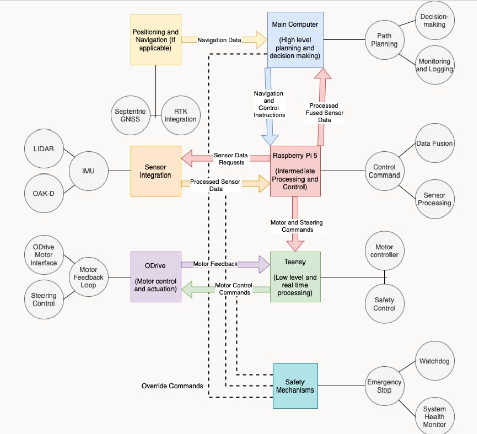

# ROB and MINI-ROB autonomous go-kart development repo
### Kennesaw State University 
### Electric Vehicle Team

This repository contains the source code for the ROB and MINI-ROB go-karts for competition in the Autonomous Karting Series. 

## Table of Contents
 - [Systems Diagram](#computing-systems-and-task-distribution-diagram)
 - [ROS2 Docker Usage](#ros2-docker-usage)
 - [PlatformIO Usage](#platformio-usage)

## Computing Systems and Task Distribution Diagram

## ROS2 Docker Usage

### Build the Docker Image:
1. run docker engine in docker desktop
2. Open a terminal, cd to the directory containing your Dockerfile and run these 2 commands:

### Build the Docker Container
`docker build -t ros2_image .`

### Run the Docker Container
`docker run -it ros2_image`

This setup creates a Docker image based on Ubuntu, installs any necessary dependencies, and runs your ROS 2 installer script inside the container.

**type "exit" to leave the container in your terminal**

## Platformio Usage
- PlatformIO is used for c++ teensy development in VSCode

### Only one file may be in src at one time
  - main.cpp is to be used as the running code

### /lib stores libraries for use in /src
  - Add neccesarry libraries as folders in lib

### How to run code
  - Open the TeensyDevelopment folder in VSCode *(BY ITSELF)*
  - Wait for platformio to load and configure
  - Open src\main.cpp
  - Check mark icon compiles code
  - -> arrow icon uploads code
  - Plug icon displays serial monitor

### How to store multiple files
  - Store files to test in TeensyTestCode
  - Comment the name of your file at the top of your cpp/ino file
  - Paste code from file to run in src\main.cpp

> Side note: any future PlatformIO projects go under the PlatformIO directory
